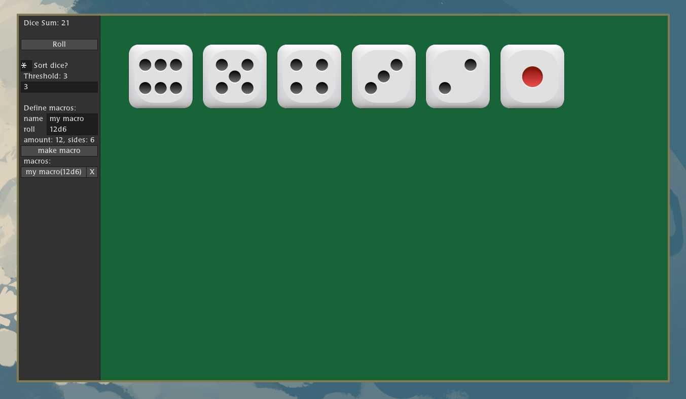

# Simple Probability

This is a small work in progress program I casually made for fun, the purpose of which is to
roll dice via a computer. It is currently not complete.



## build

```bash
cc -o nob nob.c
./nob
```

## usage

run the executable created in the base directory.
```bash
./dice
```

 - `space` to add a dice
 - left `ctrl` to roll a dice
 - `d` to remove a dice
 - `s` to toggle sorting of the dice

 There is also a hopefully self explanatory GUI panel

## planned features

 - [ ] Windows support
 - [ ] MacOS support (I do not own a MacOS device, will need to be contributed)
 - [ ] Other dice sizes besides d6 (needs assets)
 - [ ] Save and load macro list to file
 - [ ] More advanced macro syntax, i.e `12d6 + 4d8 + 5`

## small disclaimer

The external source code vendored in this repo, such as raylib and microui has been modified
for the purposes of this project. I don't know why you would want to, but do not use them
from this repo in other projects, please use the official versions.
